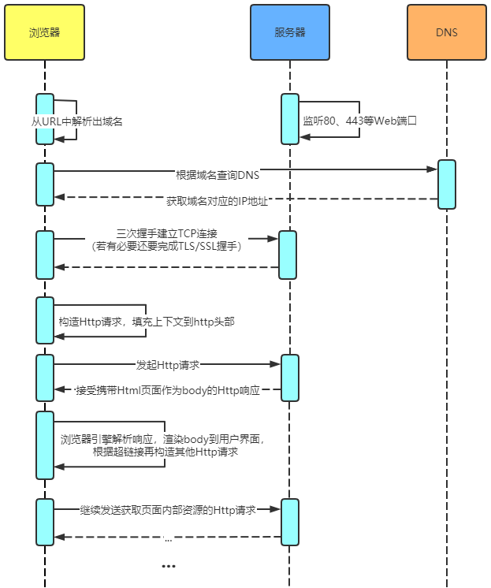
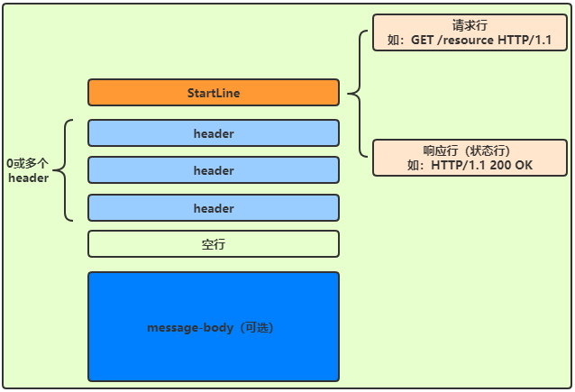
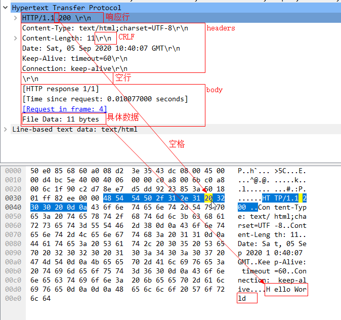

# Http协议

## 一、Http是什么
一种无状态的、应用层的、以请求/响应方式运行的协议，它使用可扩展的语义和自描述消息
格式，传输超文本内容。
- **无状态**：两个连续请求之间没有依赖关系（后一个请求依赖不了前一个请求的内容），
  服务器也分不清这两个请求是否来自同一个客户端（浏览器）。
- **应用层**：Http协议是应用层协议。
- **请求-响应**：客户端和服务器是一问一答的工作模式。
- 可扩展的语义：指浏览器不受服务器使用的Http协议版本所限制，比如浏览器支持
  Http1.1协议，那么不管服务器用Http1.0还是Http1.1，浏览器都可以正常与服务器进行
  通信，说通俗一点我觉得应该叫做兼容性。
- 自描述消息格式：指传递的消息是自描述的，可以直接知道消息是视频还是图片还是音频
  还是什么。
- **超文本**：指传输的内容不仅仅是文本，还可以是图片、音频、视频等内容。

> 浏览器发起Http请求的主要过程如下（没有考虑缓存等因素）

### 1.1 Http协议格式
平时我们描述http请求格式一般会说**一个请求行，多个消息头，一个空行，消息体**，而
响应格式就是**一个响应行，多个消息头，一个空行，消息体**，为了统一，我们可以把请
求行和响应行叫做开始行（Start Line）。

#### 1.1.1 ABNF范式
> 上面的描述还不够严谨，比如空格代表什么，多个消息头怎么分隔，消息体可有可无怎么表
> 示...因此引入了一种规则定义和描述语法规则，那就是ABNF（扩充巴科斯-瑙尔范式），
> 它是对BNF（巴科斯-瑙尔范式）的扩展，可以对字符的语义进行精确描述，下面看ABNF的介绍。

规则如下

| 规则   | 定义                                      | 说明                                    |
| ------ | ----------------------------------------- | --------------------------------------- |
| ALPHA  | %x41-5A / %x61-7A                         | 大写和小写ASCII字母（A-Z, a-z）         |
| DIGIT  | %x30-39                                   | 数字（0-9）                             |
| HEXDIG | DIGIT / "A" / "B" / "C" / "D" / "E" / "F" | 十六进制数字（0-9, A-F, a-f）           |
| DQUOTE | %x22                                      | 双引号                                  |
| SP     | %x20                                      | 空格                                    |
| HTAB   | %x09                                      | 横向制表符                              |
| WSP    | SP / HTAB                                 | 空格或横向制表符                        |
| LWSP   | *(WSP / CRLF WSP)                         | 直线空白（晚于换行）                    |
| VCHAR  | %x21-7E                                   | 可见（打印）字符                        |
| CHAR   | %x01-7F                                   | 任何7-位US-ASCII字符，不包括NUL（%x00） |
| OCTET  | %x00-FF                                   | 8位数据                                 |
| CTL    | %x00-1F / %x7F                            | 控制字符                                |
| CR     | %x0D                                      | 回车                                    |
| LF     | %x0A                                      | 换行                                    |
| CRLF   | CR LF                                     | 互联网标准换行                          |
| BIT    | "0" / "1"                                 | 二进制数字                              |

操作符如下

- 空白字符：用来分隔定义中的各个元素
  - 如 method **SP** request-target **SP** HTTP-version CRLF

- 选择 /：表示多个规则都是可供选择的规则
  - 如 start-line = request-line / status-line

- 值范围 %c##-##
  - 如OCTAL = “0” / “1” / “2” / “3” / “4” / “5” / “6” / “7” 与 OCTAL = %x30-37 等价

- 序列组合 ()：将规则组合起来，视为单个元素

- 量词 m*n：
  - 如\* 元素表示零个或更多元素： *( header-field CRLF )
  - 如1* 元素表示一个或更多元素，2*4 元素表示两个至四个元素
[http]()
- 可选序列 \[\]
  - 如\[ message-body \]

#### 1.1.2 使用ABNF描述HTTP协议格式
HTTP-message = start-line \*( header-field CRLF ) CRLF \[ message-body \]

- start-line = request-line / status-line
  - request-line = method SP request-target SP HTTP-version CRLF
  - status-line = HTTP-version SP status-code SP reason-phrase CRLF
- header-field = field-name ":" OWS field-value OWS
  - OWS = *( SP / HTAB )
  - field-name = token
  - field-value = *( field-content / obs-fold )
- message-body = *OCTET

#### 1.1.3 抓包验证
使用wireshark进行抓包，抓取某个HTTP响应如下图，符合上面ABNF描述的HTTP协议格式。

📗:介绍ABNF和抓包只为更深刻的理解HTTP消息的格式，了解即可。

